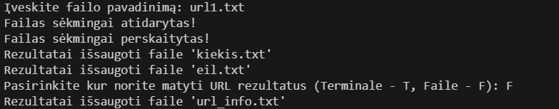
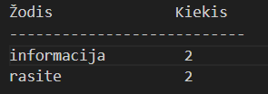
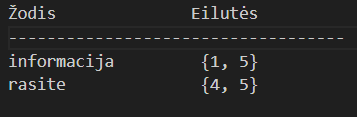
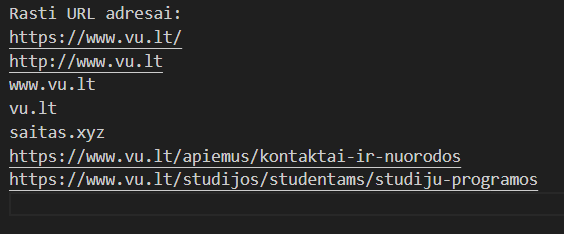

# OOP_papildoma
## Programos tikslas:

Programa skirta analizuoti tekstinius failus. Ji randa unikalius žodžius, apskaičiuoja jų pasikartojimų kiekį ir išsaugo eilutes, kuriose buvo rasti žodžiai. Programa, taip pat, randa URL adresus duotame faile.

## Programos vykdymo aprašymas:

Paleidus programą, vartotoja pasitinka pirmasis prašymas, reikalaujantis pateikti tekstinio failo pavadinimą.
Atidarius failą atliekami šie veiksmai:
- Perskaitoma tekstinio failo eilutė;
- Eilutės tekstas skaidomas į atskirus žodžius;
- Tikrinama ar žodis yra URL adresas naudojant reguliariosios išraiškos (regex) metodą;
- Toliau žodis yra atnaujinamas, panaikinami skyrybos ženklai, kurie galėjo būti prijungti, paimti kaip žodžio dalis;
- Žodis išsaugomas kaip unikalus raktas, o jo kiekis, kuris yra atnaujinamas, kaip reikšmė.
- Žodis yra išsaugojamas dar kartą kaip unikalus raktas jau kitoje struktūroje, kurioje taip pat išsaugomas pasikartojimų kiekis bei eilučių rinkinys;

Toliau vyksta rezultatų atspausdinimas, spausdinami tik tų žodžių duomenys, kurių pasikartojimų skaičius didesnis negu 1. 
Prieš atspausdinant rastus URL adresus, vartotojui suteikiamas pasirinkimas dėl rezultatų spausdinimo vietos, ar spausdinama terminale, ar faile.

## Programos naudojimosi instrukcijos:

- Paleidus programą, jums reikės pateikti failo pavadinimą, kurį norite analizuoti.
- Taip pat, reikės pasirinkti, kur norite matyti URL adresų rezultatus (Terminale - T, Faile - F).
- Rezultatus rasite: 'kiekis.txt', 'eil.txt' ir 'url_info.txt' arba terminale.

### Programos veikimo pavyzdys:

### Rezultatų pavyzdžiai:

'kiekis.txt' - nurodomi žodžiai bei jų pasikartojimų kiekis.

'eil.txt' - nurodomi žodžiai bei jų pasikartojimų eilutės.

'url_info.txt'- nurodoma rasti URL adresai.

